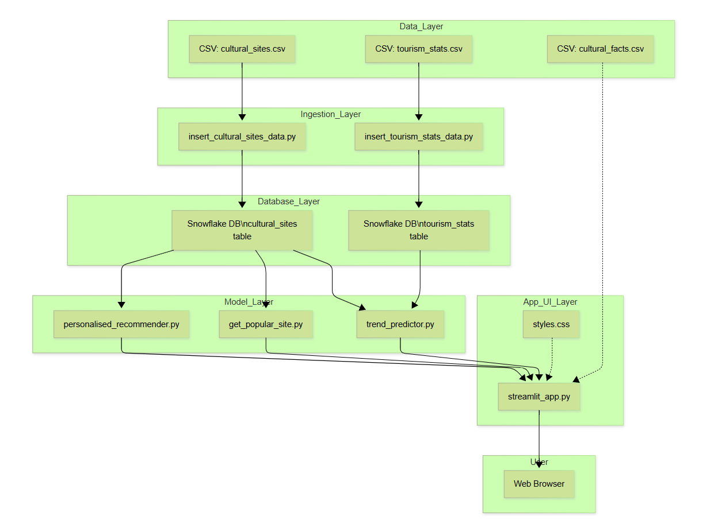

# BharatVerse - Cultural Tourism Explorer

## Project Overview

BharatVerse is an ML-powered platform to explore, analyze, and recommend India's rich cultural sites and festivals. It leverages data science, NLP, and interactive visualizations to help users discover hidden gems, plan responsible travel, and understand tourism trends.

---

## Architecture Diagram

Project Workflow Diagram:  


---

## Technology Stack

- **Frontend:** Streamlit (Python), Folium (maps), Plotly (charts), custom CSS, Font Awesome  
- **Backend:** Python (Pandas, Scikit-learn, Sentence Transformers)  
- **Database:** Snowflake (cloud data warehouse)  
- **Data Science/NLP:** Scikit-learn (trend prediction), Sentence Transformers (personalized recommendations)  
- **Data Storage:** CSV files for raw data, Snowflake for processed/queried data  

---

## Data Flow

1. **Raw Data:**  
    - `data/cultural_sites.csv`: Cultural sites and festivals  
    - `data/tourism_stats.csv`: State-wise tourism statistics  
    - `data/cultural_facts.csv`: Fun cultural facts

2. **Data Ingestion:**  
    - Scripts in `database/` load CSV data into Snowflake tables.

3. **Database Layer:**  
    - Snowflake stores and manages structured data.

4. **Model Layer:**  
    - `model/` contains:  
        - `trend_predictor.py`: Predicts future tourism trends using linear regression.  
        - `get_popular_site.py`: Recommends top sites overall or by state.  
        - `personalised_recommender.py`: Uses NLP to match user interests to site descriptions.

5. **App UI Layer:**  
    - `app_ui/streamlit_app.py`: Streamlit app for user interaction.  
    - `app_ui/styles/styles.css`: Custom styles for a polished look.

6. **User Interaction:**  
    - Users access the app via a web browser, explore maps, get recommendations, and visualize trends.

---

## Features

- **Interactive Map:** Explore sites by art form and region.
- **Tourism Trend Prediction:** Visualize and predict state-wise tourism arrivals.
- **Responsible Tourism Recommendations:** Discover top-rated sites by state.
- **AI/NLP Personalized Recommendations:** Get site suggestions based on user interests.
- **Fun Cultural Facts:** Learn interesting facts about Indian culture.
- **Modern UI:** Custom CSS and responsive design.

---

## Setup & Usage

1. **Install Requirements:**
    ```sh
    pip install streamlit pandas folium streamlit-folium plotly scikit-learn sentence-transformers snowflake-connector-python
    ```

2. **Configure Snowflake:**
    - Update credentials in `database/insert_cultural_sites_data.py` and `database/insert_tourism_stats_data.py`.

3. **Load Data:**
    ```sh
    python database/insert_cultural_sites_data.py
    python database/insert_tourism_stats_data.py
    ```

4. **Run the App:**
    ```sh
    streamlit run app_ui/streamlit_app.py
    ```

5. **Access in Browser:**
    - Open the provided local URL (usually http://localhost:8501).

---

